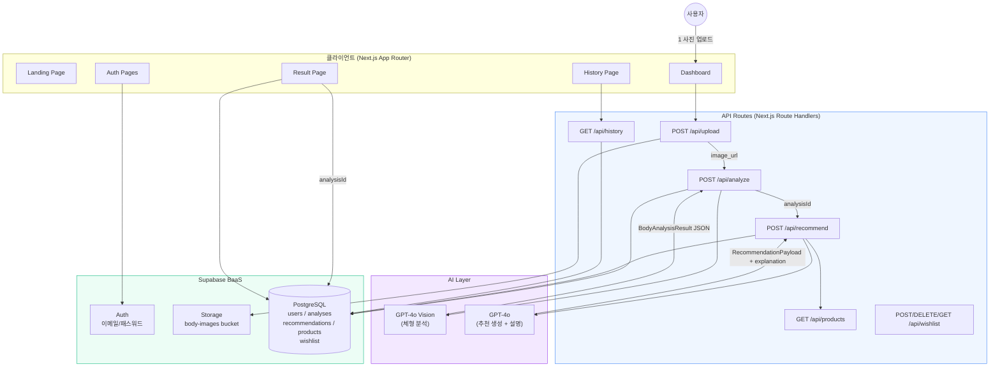

# AI Style Fit Advisor

> GPT-4o Vision 기반 체형 분석 + 맞춤 스타일 추천 웹앱  
> **AX(AI Transformation) 이커머스 포트폴리오 프로젝트**

---

## 아키텍처 다이어그램



---

## 폴더 구조

```
web_app/
├── src/
│   ├── app/
│   │   ├── page.tsx                    # Landing Page
│   │   ├── layout.tsx                  # Root Layout
│   │   ├── globals.css
│   │   ├── auth/
│   │   │   ├── login/page.tsx
│   │   │   ├── signup/page.tsx
│   │   │   └── callback/route.ts       # OAuth callback
│   │   ├── dashboard/
│   │   │   ├── page.tsx                # Server Component (auth check)
│   │   │   └── DashboardClient.tsx     # Client Component (upload flow)
│   │   ├── result/
│   │   │   └── [analysisId]/page.tsx   # Result Page (SSR)
│   │   ├── history/
│   │   │   └── page.tsx                # History Page (SSR)
│   │   └── api/
│   │       ├── upload/route.ts         # POST — Supabase Storage
│   │       ├── analyze/route.ts        # POST — GPT-4o Vision
│   │       ├── recommend/route.ts      # POST — GPT-4o + Product matching
│   │       ├── products/route.ts       # GET  — Product list
│   │       ├── history/route.ts        # GET  — User history
│   │       └── wishlist/route.ts       # POST/DELETE/GET — Wishlist
│   ├── components/
│   │   ├── layout/Navbar.tsx
│   │   ├── analysis/
│   │   │   ├── ImageUploader.tsx       # Drag & drop upload
│   │   │   └── AnalysisProgress.tsx    # Step indicator
│   │   └── products/
│   │       └── ProductCard.tsx         # Product + wishlist card
│   ├── lib/
│   │   ├── supabase/
│   │   │   ├── client.ts               # Browser client
│   │   │   └── server.ts               # Server + service-role client
│   │   ├── openai/
│   │   │   └── analyze.ts              # analyzeBodyShape(), generateRecommendation()
│   │   └── utils/
│   │       ├── cn.ts                   # tailwind-merge helper
│   │       └── recommend.ts            # rankProducts(), scoreProduct()
│   ├── types/index.ts                  # 전체 TypeScript 타입 정의
│   └── middleware.ts                   # Auth guard (SSR)
├── supabase/
│   └── schema.sql                      # DB 스키마 + RLS + Seed data
├── .env.local                          # 환경 변수 (git 제외)
├── next.config.ts
├── tailwind.config.ts
├── tsconfig.json
└── package.json
```

---

## 데이터베이스 설계

| 테이블 | 핵심 컬럼 | 설명 |
|--------|-----------|------|
| `users` | id (FK→auth.users), email | Supabase Auth 미러 |
| `analyses` | user_id, image_url, body_shape, shoulder_width, waist_line, body_balance, confidence | GPT-4o Vision 분석 결과 |
| `recommendations` | analysis_id, recommendation_json (JSONB), explanation | LLM 추천 결과 |
| `products` | name, category, fit_type, image_url, price | 상품 카탈로그 |
| `wishlist` | user_id, product_id | 유저별 위시리스트 |

**RLS 정책**: 모든 사용자 데이터는 `auth.uid() = user_id` 검증. products는 public read.

---

## API 명세

### POST `/api/upload`
**Request**: `FormData { file: File }`  
**Response**: `{ imageUrl: string, path: string }`  
**설명**: 이미지를 Supabase Storage `body-images` 버킷에 업로드

### POST `/api/analyze`
**Request**: `{ imageUrl: string }`  
**Response**: `{ analysisId, bodyShape, shoulderWidth, waistLine, bodyBalance, confidence }`  
**설명**: GPT-4o Vision으로 체형 분석 후 DB 저장

### POST `/api/recommend`
**Request**: `{ analysisId: string }`  
**Response**: `{ recommendationId, recommendation, explanation, products }`  
**설명**: 체형 분석 기반으로 스타일 추천 + 매칭 상품 반환

### GET `/api/products`
**Query**: `?bodyShape=&category=&limit=&offset=`  
**Response**: `{ products: DbProduct[], total: number }`  
**설명**: 체형 기반 상품 필터링 및 정렬

### GET `/api/history`
**Response**: `{ items: HistoryItem[] }`  
**설명**: 로그인 사용자의 분석 히스토리 (최신순 20건)

---

## 핵심 AI 로직

### 체형 분류 (GPT-4o Vision)
```
사용자 이미지 → GPT-4o Vision
→ { bodyShape, shoulderWidth, waistLine, bodyBalance, confidence }
```
- 5가지 체형: triangle / inverted_triangle / rectangle / hourglass / oval
- System Prompt: 체중/BMI 배제, 구조적 비율만 분석

### 추천 생성 (GPT-4o Text)
```
BodyAnalysisResult → GPT-4o
→ { recommendedFits, tops, bottoms, outers, avoid }
→ Korean explanation (3문장, 코치 스타일)
```

### 상품 매칭 (Rule-based Scoring)
```
bodyShape × fit_type → scoreProduct()
→ rankProducts() (카테고리 다양성 보장)
```

| 체형 | 우선 핏 |
|------|---------|
| triangle | wide fit, flare fit, a-line |
| inverted_triangle | wide fit, flare fit, a-line, regular fit |
| rectangle | oversized fit, semi oversized, relaxed fit |
| hourglass | slim fit, regular fit, a-line |
| oval | relaxed fit, regular fit, a-line |

---

## 비즈니스 임팩트 (AX 관점)

### 1. 문제 정의
온라인 의류 구매 시 사이즈·핏 선택의 어려움:
- 반품률 약 30~40% (의류 카테고리 최고 수준)
- "착용해보지 못한" 불안으로 구매 이탈 증가
- CS 비용 증가 및 재고 손실

### 2. AI 기반 해결책
| 기존 방식 | AI 전환 후 |
|-----------|------------|
| 사이즈 가이드표 텍스트 | Vision AI 체형 실측 분석 |
| 일반 스타일링 콘텐츠 | 개인 체형 맞춤 추천 |
| 수동 필터 탐색 | AI 큐레이션 상품 리스트 |
| 구매 후 반품 | 구매 전 핏 확인 |

### 3. 기대 효과
- **구매 전환율 +30~50%**: 핏 불확실성 해소
- **반품률 -40~60%**: 체형 맞는 상품 추천
- **고객 체류시간 +2분**: 개인화 콘텐츠 몰입
- **CS 비용 절감**: 핏 관련 문의 감소

### 4. AX(AI Transformation) 전략적 의미
> 단순 체형 분류가 아닌 **구매 의사결정 지원(Purchase Decision Support)** 서비스

- **생성형 AI 활용**: GPT-4o Vision의 멀티모달 능력으로 체형 분류 자동화
- **LLM 개인화**: 체형별 설명 자동 생성으로 고객 교육 비용 제거
- **AI-First 아키텍처**: 분석→추천→구매 전 과정에 AI 적용
- **확장성**: 브랜드 상품 연동, 계절별 추천, 가격대 필터 등 추가 용이

---

## 배포 (Vercel + Supabase)

### 1. Supabase 설정

```bash
# Supabase 대시보드에서:
# 1. New Project 생성
# 2. SQL Editor에서 supabase/schema.sql 실행
# 3. Storage > New bucket: "body-images" (Public)
# 4. Project Settings > API에서 키 복사
```

### 2. 환경 변수 설정

```bash
# .env.local (로컬) 또는 Vercel Dashboard > Environment Variables
NEXT_PUBLIC_SUPABASE_URL=https://xxxx.supabase.co
NEXT_PUBLIC_SUPABASE_ANON_KEY=eyJhb...
SUPABASE_SERVICE_ROLE_KEY=eyJhb...
OPENAI_API_KEY=sk-...
NEXT_PUBLIC_APP_URL=https://your-app.vercel.app
```

### 3. Vercel 배포

```bash
# Option A: Vercel CLI
npm i -g vercel
vercel --prod

# Option B: GitHub 연동 (추천)
# 1. GitHub에 push
# 2. vercel.com에서 "Import Project"
# 3. Environment Variables 입력
# 4. Deploy
```

### 4. Supabase Auth 콜백 URL 등록
```
Supabase Dashboard > Authentication > URL Configuration
Site URL: https://your-app.vercel.app
Redirect URLs: https://your-app.vercel.app/auth/callback
```

---

## 로컬 개발

```bash
# 1. 의존성 설치
npm install

# 2. 환경 변수 설정
cp .env.local.example .env.local
# .env.local 파일에 실제 키 값 입력

# 3. 개발 서버 실행
npm run dev
# → http://localhost:3000
```

---

## 기술 스택

| 영역 | 기술 | 선택 이유 |
|------|------|-----------|
| Frontend | Next.js 15 (App Router) | SSR/SSG 유연성, Server Actions |
| Language | TypeScript | 타입 안전성, LLM 응답 스키마 보장 |
| Styling | Tailwind CSS + shadcn/ui | 빠른 UI 개발, 접근성 |
| Database | Supabase PostgreSQL | 관리형 DB + RLS 보안 |
| Auth | Supabase Auth | 빠른 구현, JWT 자동 처리 |
| Storage | Supabase Storage | 이미지 CDN + 접근 제어 |
| AI | OpenAI GPT-4o | 최고 수준 Vision + Text 능력 |
| Deployment | Vercel | Next.js 최적화, Edge Runtime |

---

## 라이선스

MIT — 포트폴리오 목적의 오픈소스 프로젝트
